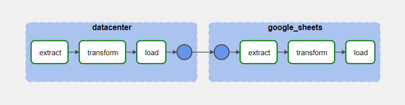

# ETL PlayStation 1 Collection Tracker

An ETL process to extract and track PlayStation 1 games from a collection.

# Description
PS1 games are extracted from the PlayStation Datacenter website ([https://psxdatacenter.com/ntsc-u_list.html](https://psxdatacenter.com/ntsc-u_list.html)) using web scraping with the BeautifulSoup library. The data is then stored in an SQLite database using SQLAlchemy for the creation and population of tables.

The database stores the following information:

-   Game names
-   Disc codes for each game
-   Number of discs each game has
-   Language(s) in which each game was released

Additionally, the names of the games acquired by a hypothetical collector are extracted from a Google Sheets spreadsheet using the gspread API and cross-referenced with the games from the PlayStation Datacenter.

# Getting Started

## Setup

### Google Sheets Acquired Games List
You need to set up a Google Sheets spreadsheet to store the acquired games. This Google Sheet should follow this model: 

- One column containing the name of the game and another containing "1" for acquired games or blank if not acquired. 

You also need to generate a `credentials.json` file for authentication with Google. You can do this by following the tutorial [here](https://docs.gspread.org/en/latest/oauth2.html#for-bots-using-service-account).

## Requirements

The requirements are described in the `requirements.txt` file.

It's advised to run this project using Docker.

## Environment Variables
The following environment variables are required. 

"DATACENTER_EXTRACT_OUTPUT_PATH":"data/extracted",
"DATACENTER_TRANSFORM_INPUT_PATH":"data/extracted",
"DATACENTER_TRANSFORM_OUTPUT_PATH":"data/transformed",
"DATACENTER_LOAD_INPUT_PATH":"data/transformed",
"DATACENTER_LOAD_DATABASE_PATH":"data/database",
"GOOGLE_SHEET_CREDENTIALS_PATH":"data/credentials/credentials.json",
"GOOGLE_SHEET_EXTRACT_OUTPUT_PATH":"data/extracted",
"GOOGLE_SHEET_TRANSFORM_INPUT_PATH":"data/extracted",
"GOOGLE_SHEET_TRANSFORM_OUTPUT_PATH":"data/transformed",
"GOOGLE_SHEET_LOAD_INPUT_PATH":"data/transformed",
"GOOGLE_SHEET_LOAD_DATABASE_PATH":"data/database"

Important: 
- The extracted and transformed directories will contain the data extracted and transformed by the ETL. 
- You will need to fill `GOOGLE_SHEET_CREDENTIALS_PATH` with the `credentials.json` file for authentication that you generated earlier.

## Executing
There are two methods for running this project. The first one is using the `run.sh` file, and the other one is using Airflow. We will briefly describe both methods below.

### Using `run.sh` file
The `run.sh` will build the Dockerfile of this project and automatically run all the scripts of the project. The final result will be a SQLite Database containing all the project's data. 

Make sure to create a `.env` file in the root of the project containing the environment variables describled above.

### Using Airflow
We also provide an Airflow DAG, which you can find in the `dags` folder. It uses DockerOperator to run all the tasks of this project.

